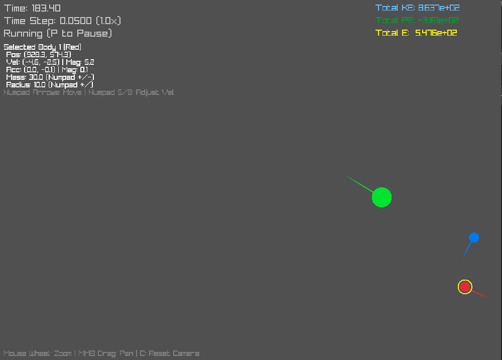

# Advanced 3-Body Simulation with Raylib (RK4) 🌌

This project simulates the gravitational interaction between three bodies in 2D space using Newton's law of universal gravitation. It employs the **Runge-Kutta 4th order (RK4)** numerical integration method for improved accuracy compared to simpler methods like Euler integration, which is crucial for simulating potentially chaotic systems like the 3-body problem. Visualization is handled by the excellent [Raylib](https://www.raylib.com/) library.

[](pic.png)


## ✨ Features

*   **3-Body Gravitational Simulation:** Calculates forces between all pairs of bodies.
*   **RK4 Integration:** Uses the Runge-Kutta 4th order method for accurate trajectory calculation and better energy conservation over time.
*   **Raylib Visualization:** Renders the bodies and their trails using the Raylib graphics library.
*   **Body Trails:** Visualizes the recent path of each body, making orbits easier to follow.
*   **Interactive Controls:**
    *   Pause/Resume the simulation.
    *   Restart the simulation to initial conditions.
    *   Select individual bodies.
    *   Adjust the mass, radius, position, and velocity of the selected body using the Numpad.
    *   Control the simulation speed (time scale).
*   **Camera Controls:** Zoom in/out using the mouse wheel and pan the view by dragging with the middle mouse button. Reset the view with 'C'.
*   **Energy Monitoring:** Displays the total Kinetic Energy (KE), Potential Energy (PE), and Total Energy (KE + PE) of the system. Watching the Total Energy helps gauge the simulation's stability (it should remain relatively constant).
*   **Softening Factor:** Implements a softening factor to prevent infinitely large forces and numerical instability when bodies get extremely close.

## 🔧 Dependencies

*   **Raylib:** The core graphics and utility library. You need to have Raylib installed or available for linking. ([Installation Guide](https://github.com/raysan5/raylib/wiki/Working-on-GNU-Linux) or [Windows](https://github.com/raysan5/raylib/wiki/Working-on-Windows))
*   **C++ Compiler:** A compiler supporting C++11 or later (due to `std::vector`, `std::deque`, etc.). Examples:
    *   GCC (g++)
    *   Clang
    *   MSVC (Visual Studio)

## ⚙️ Building

The specific command depends on your operating system and how you have Raylib set up. Here are some examples:

**1. Linux/macOS (using GCC/Clang):**

Make sure Raylib is installed system-wide or provide the paths to its include and library files.

```bash
# If Raylib is installed system-wide
g++ main.cpp -o 3body_sim -lraylib -lm -lpthread -ldl -lrt -lX11 -std=c++11

# If Raylib is in a specific folder (e.g., ../raylib)
g++ main.cpp -o 3body_sim -I../raylib/src -L../raylib/src -lraylib -lm -lpthread -ldl -lrt -lX11 -std=c++11
# On macOS, you might need -framework CoreVideo -framework IOKit -framework Cocoa -framework GLUT -framework OpenGL instead of the X11 libs
```

2. Windows (using MinGW/GCC):

You'll need to point the compiler to your Raylib installation's include and lib directories.
```
# Replace C:/path/to/raylib with your actual Raylib path
g++ main.cpp -o 3body_sim.exe -I C:/path/to/raylib/include -L C:/path/to/raylib/lib -lraylib -lopengl32 -lgdi32 -lwinmm -std=c++11
# If using static Raylib library, linking flags might differ slightly (check Raylib examples)
```

▶️ Running

Once successfully compiled, run the executable from your terminal:

## Linux/macOS
./3body_sim

## Windows
.\3body_sim.exe

# ⌨️ Controls

## Simulation:

P: Pause / Resume the simulation.

R: Restart the simulation to the initial conditions.

= / + / Numpad +: Increase simulation speed (time scale).

- / Numpad -: Decrease simulation speed (time scale).

## Camera:

Mouse Wheel: Zoom in / Zoom out (centered on mouse pointer).

Middle Mouse Button Drag: Pan the view.

C: Reset camera zoom and position.

## Body Selection:

1, 2, 3: Select body 1, 2, or 3 respectively.

Selected Body Modification (Use Numpad):

Numpad 4/6/8/2 (Arrows): Nudge position (while key is held down).

Numpad 4/6: Decrease/Increase X Velocity (on key press).

Numpad 8/2: Decrease/Increase Y Velocity (on key press).

Numpad . (Decimal): Set velocity to zero.

Numpad +: Increase Mass.

Numpad -: Decrease Mass (cannot go below 0.01).

Numpad *: Increase Radius.

Numpad /: Decrease Radius (cannot go below 1.0).

# 📝 Notes & Known Issues

Sensitivity: The 3-body problem is famously chaotic. Tiny changes to initial positions, velocities, masses, the value of G, currentTimeStep, or softingFactor can lead to drastically different long-term behavior. Achieving specific stable orbits (like the Figure-8) requires very precise initial conditions and parameter tuning specific to the simulation setup.

Parameter Tuning: The default G, softingFactor, and currentTimeStep values are starting points. You will likely need to experiment with these, especially G and currentTimeStep, to get visually interesting or stable results depending on the scale and mass ratios you choose for your initial conditions. Smaller currentTimeStep increases accuracy but slows down the simulation.

Energy Conservation: While RK4 is much better than Euler, some energy drift may still occur over very long simulation times, especially with larger time steps or extremely close encounters where the softening factor significantly alters the force calculation. Monitor the "Total E" display.

No Collision Handling: Bodies are treated as point masses for gravity calculations and will pass through each other visually.

# 🚀 Future Enhancements Ideas

Implement other integrators (e.g., Velocity Verlet, Leapfrog) for comparison.

Add adaptive time-stepping (reduce timestep during close encounters).

Implement basic collision detection and handling (e.g., merging bodies or elastic/inelastic collisions).

Allow saving and loading initial condition presets from a file.

Generalize the simulation to handle N bodies.

Add options for different visualization modes (e.g., show velocity vectors).

Integrate raygui for a more sophisticated user interface.

Create a robust build system using CMake.

# License

MIT License

By Wasswa Lutufi Sebbanja

wasswalutufi@gmail.com
